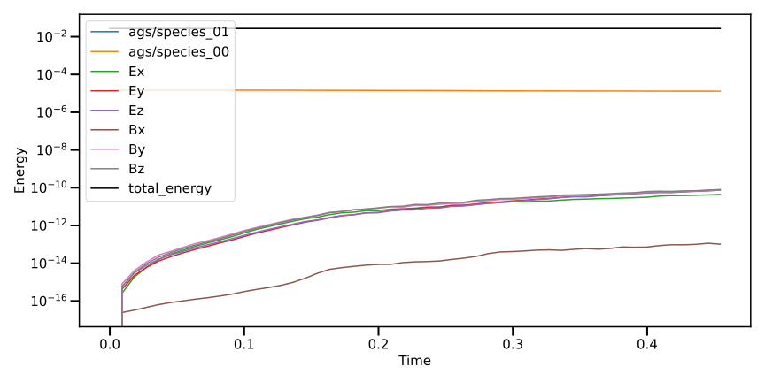
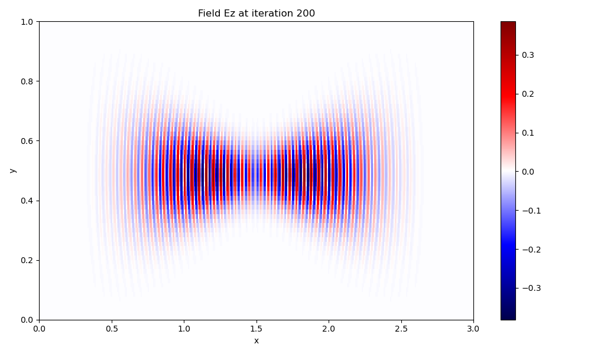

# Plotting Diags

Some python scripts are provided to plot the diagnostics files.
The scripts are located in the `scripts` folder.

## Installation

You need to have the `libminipic` installed to use the scripts.
Please [follow the documentation](./python_tools.md#installation) to install it.

## Available scripts

### `plot_energy_balance.py`

Plot the energy balance of the simulation using the scalars

| Option | Long Option | Description              |
|--------|-------------|--------------------------|
| `-f`   | `--folder`  | Path to the diags folder |

```bash
# Example
python plot_energy_balance.py -f diags/
```



### `plot_particle_binning.py`

Plot particle binning diags (1D, 2D or 3D) only for the custom binary format

| Positional argument | Description              |
|---------------------|--------------------------|
| `file`              | Path to the file to plot |

| Option | Long Option  | Description     |
|--------|--------------|-----------------|
| `-c`   | `--colormap` | Colormap to use |


```bash
# Example
python plot_particle_binning.py diags/diag_w_gamma_s00_0300.bin
```

### `plot_particle_cloud.py`

Plot particle cloud using Matplotlib and the binary custom format. We recommend to use Paraview with the VTK format for better results.

| Positional argument | Description              |
|---------------------|--------------------------|
| `file`              | Path to the file to plot |

### `plot_field.py`

Plot a field diag using Matplotlib (2D slice)

| Positional argument | Description              |
|---------------------|--------------------------|
| `file`              | Path to the file to plot |

| Option | Long Option  | Description              |
|--------|--------------|--------------------------|
| `-c`   | `--colormap` | Colormap to use          |

```bash
# Example
python plot_field.py -f diags/Ez_200.bin
```


